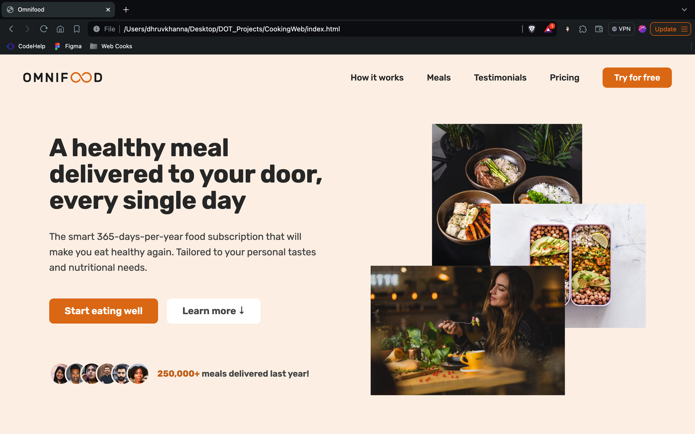
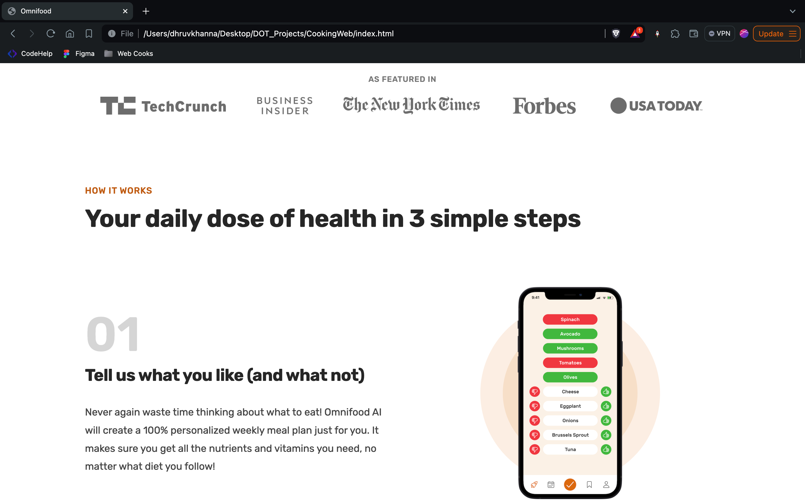
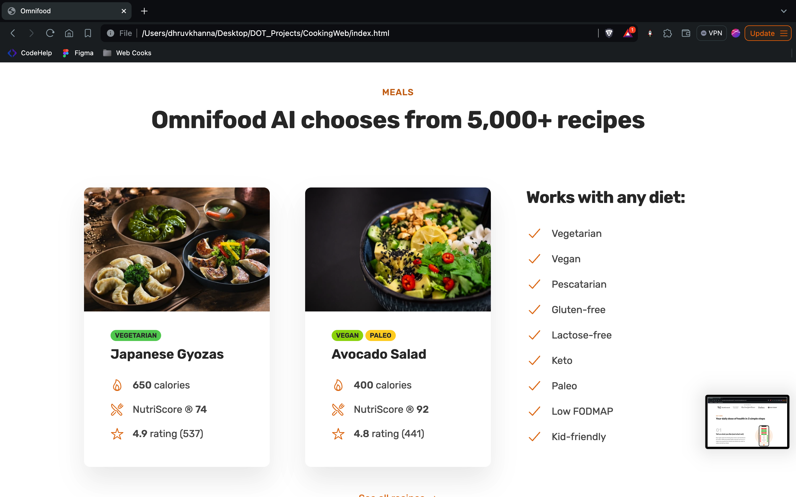
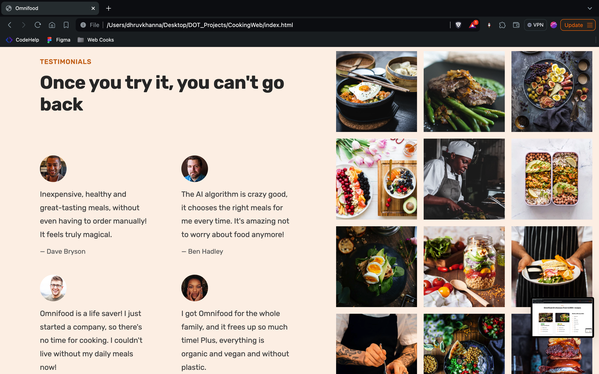

# OmniFood

OmniFood is a frontend project that offers a mock-up of a food delivery service website. It showcases a variety of meals, subscription plans, and customer testimonials. The project is built using HTML and CSS.

## Table of Contents

- [Demo](#demo)
- [Features](#features)
- [Technologies Used](#technologies-used)
- [Setup](#setup)
- [Usage](#usage)
- [Customization](#customization)
- [Contributing](#contributing)

## Demo






You can check out the live demo of the project [here](https://your-demo-url.com).

## Features

- Responsive design
- Showcase of various meal options
- Subscription plans
- Customer testimonials
- Featured in popular media

## Technologies Used

- HTML5
- CSS3

## Setup

To set up the project locally, follow these steps:

1. **Clone the repository:**
   ```bash
   git clone https://github.com/your-username/omnifood.git
   cd omnifood


## Usage

To use or view the website, simply open the `index.html` file in any web browser. No additional setup is required since the project only uses HTML and CSS.

## Customization

You can customize the website by modifying the HTML and CSS files located in the following directories:

- `index.html`
- `css/general.css`
- `css/style.css`
- `css/queries.css`

## Contributing

If you would like to contribute to this project, please fork the repository and create a pull request. Contributions are welcome!

